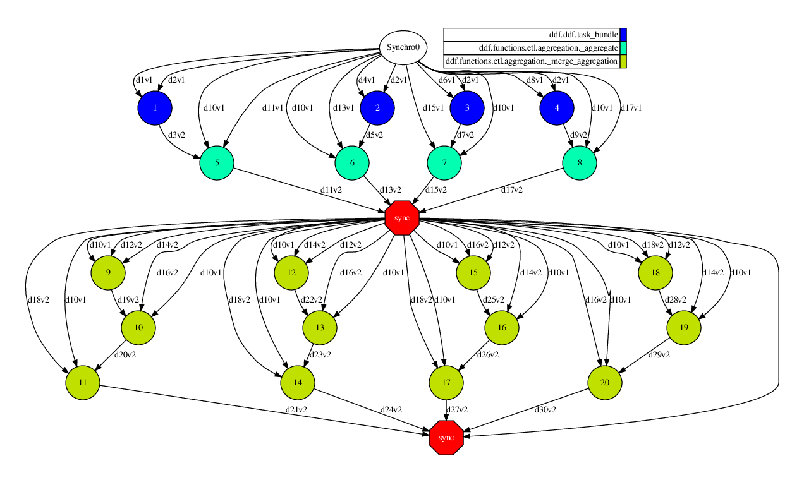

<h1 align="center">  
        
</h1>

<h3 align="center">A PyCOMPSs library for Big Data scenarios.</h3>

<p align="center"><b>
    <a href="#">Documentation</a> •
    <a href="https://github.com/eubr-bigsea/Compss-Python/tree/compss2.5/releases">Releases</a>
</b>

</p>


## Introduction

The Distributed DataFrame Library provides distributed algorithms and operations ready to use as a library 
implemented over [PyCOMPSs](https://pypi.org/project/pycompss/) programming model. Currently, is highly focused on 
ETL (extract-transform-load) and Machine Learning algorithms to Data Science tasks. DDF is greatly inspired by Spark's 
DataFrame and its operators.

Currently, an operation can be of two types, transformations or actions. Action operations are those that produce 
a final result (whether to save to a file or to display on screen). Transformation operations are those that will 
transform an input DDF into another output DDF. Besides this classification, there are operations with one processing 
stage and those with two or more stages of processing (those that need to exchange information between the partitions).

When running DDF operation/algorithms, a context variable (COMPSs Context) will check the possibility of 
optimizations during the scheduling of COMPS tasks. These optimizations can be of the type: grouping one stage 
operations to a single task COMPSs and stacking operations until an action operation is found.


## Contents

- [Algorithms and operations currently available](#algorithms-and-operations-available)
- [Example of use](#example-of-use)
- [Requirements](#requirements)
- [Publications](#publications)
- [License](#license)

 
## Algorithms and operations available:

 - ETL: Add Columns, Aggregation, Change attribute, Clean Missing Values, Difference, Distinct (Remove Duplicated Rows), 
 Drop Columns, Set-Intersect, Join (Inner, Left or Right), Load Data, Replace Values, Sample Rows, Save data, 
 Select Columns, Sort, Split, Transform (Map operations), Union
 - ML:
   - Evaluator Models: Binary Classification Metrics, Multi-label Metrics and Regression Metrics
   - Feature Operations: Vector Assembler, Simple Tokenizer, Regex Tokenizer, Remove Stop-Words,
           Count Vectorizer, Tf-idf Vectorizer, String Indexer,
           Index To String, Max-Abs Scaler, Min-Max Scaler, Standard Scaler, PCA
   
   - Frequent Pattern Mining: Apriori and Association Rules
   - Classification: K-Nearest Neighbors, Gaussian Naive Bayes, Logistic Regression, SVM
   - Clustering: K-means (using random or k-means|| initialization method), DBSCAN
   - Regression: Linear Regression using method of least squares (works only for 2-D data) or using 
   Stochastic Gradient Descent
  - Geographic Operations: Load data from shapefile, Geo Within (Select rows that exists within a specified shape)
  - Graph Operations: Initially, only Page Rank are present

 
### Example of use:

The following code is an example of how to use this library for Data Science purposes. In this example, we want
to know the number of men, women and children who survived or died in the Titanic crash.

In the first part, we will perform some pre-processing (remove some columns, clean some rows that
have missing values, replace some value and filter rows) and after that, aggregate the information for adult women.

For explanatory aspects, the input data (Pandas DataFrame) is distributed by COMPSs in 4 fragments using `parallelize()`. 
At this point, the programmer no longer has to worry about partitioning the data. All operations will be able to 
work transparently to the user. The COMPS tasks will be executed in parallel, one for each fragment. 

```python
from ddf.ddf import DDF
import pandas as pd

url = 'https://raw.githubusercontent.com/eubr-bigsea/' \
      'Compss-Python/compss2.5/ddf/docs/titanic.csv'
df = pd.read_csv(url, sep='\t')

ddf1 = DDF().parallelize(df, num_of_parts=4)\
    .select(['Sex', 'Age', 'Survived'])\
    .clean_missing(['Sex', 'Age'], mode='REMOVE_ROW')\
    .replace({0: 'No', 1: 'Yes'}, subset=['Survived'])

ddf_women = ddf1.filter('(Sex == "female") and (Age >= 18)').\
    aggregation(group_by=['Survived'],
                exprs={'Survived': ['count']},
                aliases={'Survived': ["Women"]})

print ddf_women.show()
```

The image shows the DAG created by COMPSs during the execution. The operations `select(), clean_missing(), replace() and filter()` 
are some of them that are 'one processing stage' and then, the library was capable of group into a single COMPSs task 
(which was named task_bundle). In this DAG, the other tasks are referring to the operation of `aggregation()`. This operations  
needs certain exchanges of information, so it performs a synchronization of some indices (light data) for submit the
 minimum amount of tasks from master node. Finally, the last synchronization is performed by `show()` function 
 (which is an action) to receives the data produced.




Next, we extend the previous code to computate the result also for men and kids. 


```python
from ddf.ddf import DDF
import pandas as pd

url = 'https://gist.githubusercontent.com/michhar/' \
      '2dfd2de0d4f8727f873422c5d959fff5/raw/' \
      'ff414a1bcfcba32481e4d4e8db578e55872a2ca1/titanic.csv'
df = pd.read_csv(url, sep='\t')

ddf1 = DDF().parallelize(df, num_of_parts=4)\
    .select(['Sex', 'Age', 'Survived'])\
    .clean_missing(['Sex', 'Age'], mode='REMOVE_ROW')\
    .replace({0: 'No', 1: 'Yes'}, subset=['Survived']).cache()

ddf_women = ddf1.filter('(Sex == "female") and (Age >= 18)').\
    aggregation(group_by=['Survived'],
                exprs={'Survived': ['count']},
                aliases={'Survived': ["Women"]})

ddf_kids = ddf1.filter('Age < 18').\
    aggregation(group_by=['Survived'],
                exprs={'Survived': ['count']},
                aliases={'Survived': ["Kids"]})

ddf_men = ddf1.filter('(Sex == "male") and (Age >= 18)').\
    aggregation(group_by=['Survived'],
                exprs={'Survived': ['count']},
                aliases={'Survived': ["Men"]})

ddf_final = ddf_women\
    .join(ddf_men, key1=['Survived'], key2=['Survived'], mode='inner')\
    .join(ddf_kids, key1=['Survived'], key2=['Survived'], mode='inner')

print ddf_final.show()

```

This code will produce following result:


| Survived  | Women | Men | Kids |
| ----------|------ | ----|----- |
| No        |   8   | 63  |  14  |
| Yes       |  24   | 7   | 10   |


## Requirements

Besides the PyCOMPSs installation, DDF uses others third-party libraries. If you want to read and save data from HDFS, 
you need to install [hdfspycompss](https://github.com/eubr-bigsea/compss-hdfs/tree/master/Python) library. The others 
dependencies can be installed by using the command `$ pip install -r requirements.txt` 

```
Pyqtree == 0.24
matplotlib == 1.5.1
networkx == 1.11
numpy == 1.16.0
pandas == 0.23.4
pyshp == 1.2.11
python_dateutil == 2.6.1
```

## Publications

```
PONCE, Lucas M.; SANTOS, Walter dos; MEIRA JR., Wagner; GUEDES, Dorgival. 
Extensão de um ambiente de computação de alto desempenho para o processamento de dados massivos. 
In: BRAZILIAN SYMPOSIUM ON COMPUTER NETWORKS AND DISTRIBUTED SYSTEMS (SBRC), 2018 
Proceedings of the 36th Brazilian Symposium on Computer Networks and Distributed Systems. 
Porto Alegre: Sociedade Brasileira de Computação, may 2018. ISSN 2177-9384.
```
## License

Apache License Version 2.0, see [LICENSE](LICENSE)
