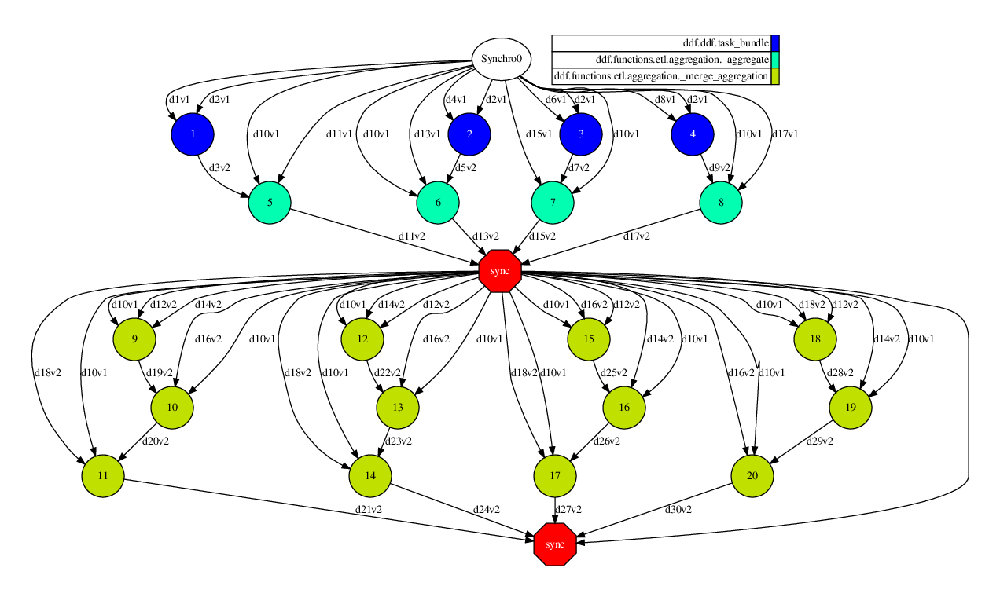

******************************
Example of use: Titanic
******************************

The following code is an example of how to use this library for Data Science purposes. In this example, we want
to know the number of men, women and children who survived or died in the Titanic crash.

In the first part, we will perform some pre-processing (remove some columns, clean some rows that
have missing values, replace some value and filter rows) and after that, aggregate the information for adult women.

For explanatory aspects, the input data (Pandas DataFrame) is distributed by COMPSs in 4 fragments using `parallelize()`. 
At this point, the programmer no longer has to worry about partitioning the data. All operations will be able to 
work transparently to the user. The COMPS tasks will be executed in parallel, one for each fragment. 

.. code-block:: python

    from ddf.ddf import DDF
    import pandas as pd

    url = 'https://raw.githubusercontent.com/eubr-bigsea/Compss-Python/dev/docs/titanic.csv'
    df = pd.read_csv(url, sep='\t')

    ddf1 = DDF().parallelize(df, num_of_parts=4)\
        .select(['Sex', 'Age', 'Survived'])\
        .clean_missing(['Sex', 'Age'], mode='REMOVE_ROW')\
        .replace({0: 'No', 1: 'Yes'}, subset=['Survived'])

    ddf_women = ddf1.filter('(Sex == "female") and (Age >= 18)').\
        aggregation(group_by=['Survived'],
                    exprs={'Survived': ['count']},
                    aliases={'Survived': ["Women"]})

    print ddf_women.show()

The image shows the DAG created by COMPSs during the execution. The operations `select(), clean_missing(), replace() and filter()` 
are some of them that are 'one processing stage' and then, the library was capable of group into a single COMPSs task 
(which was named task_bundle). In this DAG, the other tasks are referring to the operation of `aggregation()`. This operations  
needs certain exchanges of information, so it performs a synchronization of some indices (light data) for submit the minimum amount of tasks from master node. Finally, the last synchronization is performed by `show()` function (which is an action) to receives the data produced.

Next, we extend the previous code to computate the result also for men and kids. 

.. code-block:: python

    from ddf.ddf import DDF
    import pandas as pd

    url = 'https://raw.githubusercontent.com/eubr-bigsea/Compss-Python/dev/docs/titanic.csv'
    df = pd.read_csv(url, sep='\t')

    ddf1 = DDF().parallelize(df, num_of_parts=4)\
        .select(['Sex', 'Age', 'Survived'])\
        .clean_missing(['Sex', 'Age'], mode='REMOVE_ROW')\
        .replace({0: 'No', 1: 'Yes'}, subset=['Survived']).cache()

    ddf_women = ddf1.filter('(Sex == "female") and (Age >= 18)').\
        aggregation(group_by=['Survived'],
                    exprs={'Survived': ['count']},
                    aliases={'Survived': ["Women"]})

    ddf_kids = ddf1.filter('Age < 18').\
        aggregation(group_by=['Survived'],
                    exprs={'Survived': ['count']},
                    aliases={'Survived': ["Kids"]})

    ddf_men = ddf1.filter('(Sex == "male") and (Age >= 18)').\
        aggregation(group_by=['Survived'],
                    exprs={'Survived': ['count']},
                    aliases={'Survived': ["Men"]})

    ddf_final = ddf_women\
        .join(ddf_men, key1=['Survived'], key2=['Survived'], mode='inner')\
        .join(ddf_kids, key1=['Survived'], key2=['Survived'], mode='inner')

    print ddf_final.show()

This code will produce following result:

+-----------+-------+-----+------+
| Survived  | Women | Men | Kids |
+===========+=======+=====+======+
| No        |   8   | 63  |  14  |
+-----------+-------+-----+------+
| Yes       |  24   | 7   | 10   |
+-----------+-------+-----+------+
