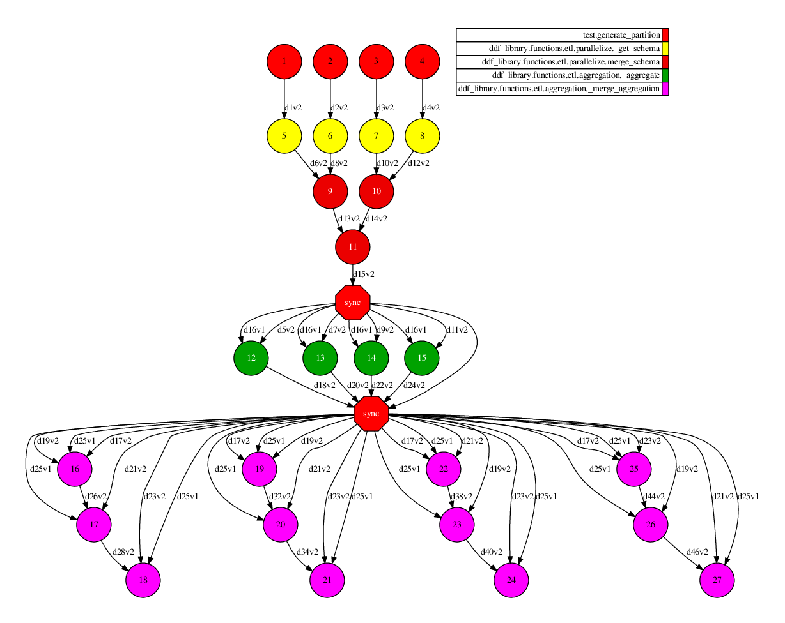
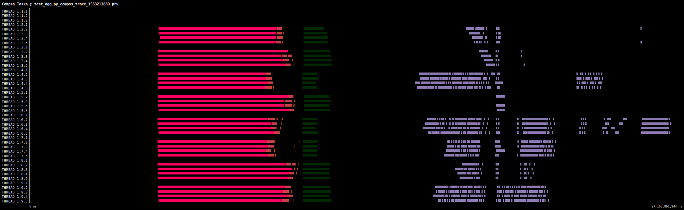

# Aggregation

Computes aggregates and returns the result as a DDF. This test groups rows by an column ('col_label') and project the first row of 'col1' and the number of rows in each group.

# Use Case:

 - Number of workers/partitions: 8 workers / 32 fragments
 - Data length: 100kk rows of 2-dimension (col_label and col1)
 - Parameters: group_by=col_label, first(col1) and count(col1)
 - Time to run: 45 seconds

## DAG

DAG using 4 cores/fragments

## Trace

Trace using 32 cores/fragments

