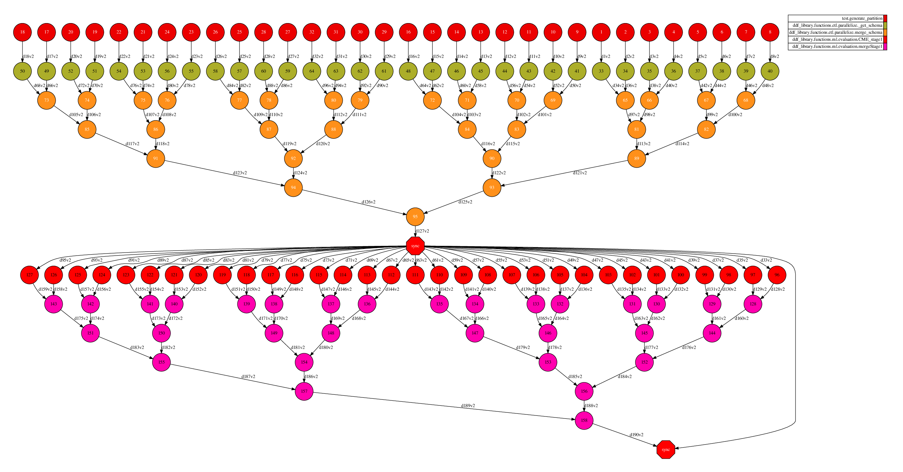
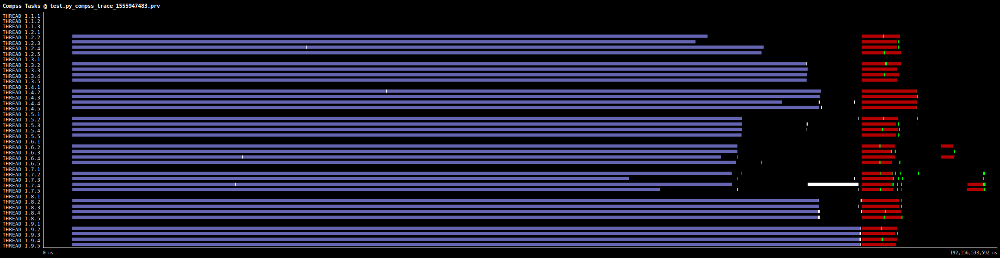
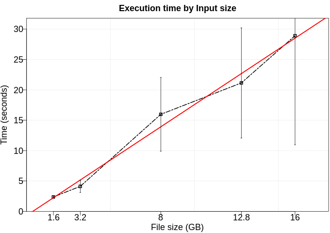

# Binary Evaluator

Calculates: Accuracy, Precision, Recall, F-measure and Confusion matrix

# Use Case:

 - Number of workers/partitions: 8 workers / 32 fragments
 - Data length: 100kk rows of 2-dimension (col_label and col1)
 - Time to run: 3 seconds

## DAG

DAG using 4 cores/fragments

## Trace

Trace using 32 cores/fragments

## Execution time by Input size

To the next test, we executed this application using five different numbers of rows (100kk, 200kk, 500k, 800kk, 1600kk). Furthermore, each configuration was executed five times. In this experiment, we excluded the time to data generation. 

