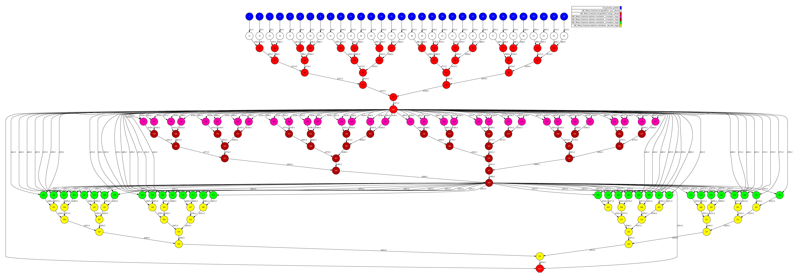
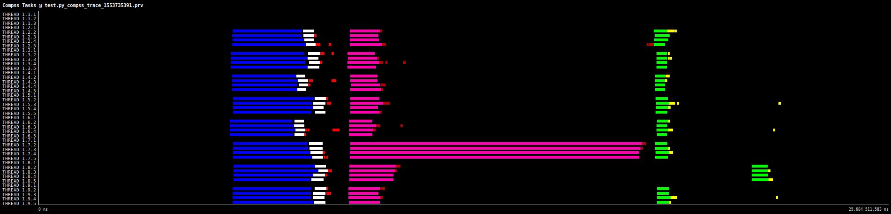
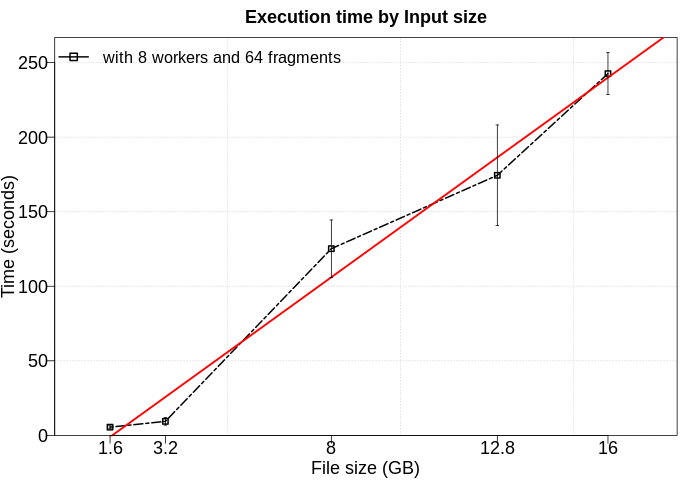

# Pearson Correlation Coefficient

Calculate the Pearson Correlation Coefficient. The input data is a DataFrame with two columns of float numbers. This test check the correlation between them.

# Use Case:

 - Number of workers/partitions: 8 workers / 32 fragments
 - Data length: 100kk rows of 2-dimension (~1.6 GB)
 - Time to run: 28 seconds

## DAG

## Trace

## Execution time by Input size

To the next test, we executed this application using five different numbers of rows (100kk, 200kk, 500kk, 800kk, 1000kk). Furthermore, each configuration was executed five times. In this experiment, we excluded the time to data generation. 

