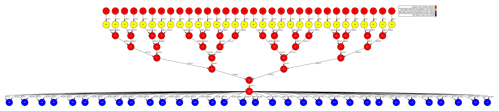
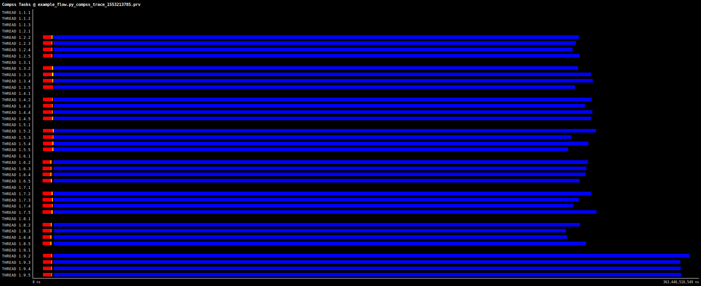
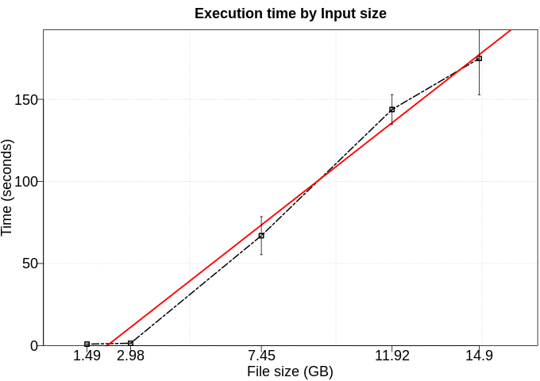

# Example of a simple flow of operations

Logistic regression is named for the function used at the core of the method, the logistic function. It is the go-to method for binary classification problems (problems with two class values). This implementation uses a Stochastic Gradient Ascent (a variant of the Stochastic gradient descent). It is called stochastic because the derivative based on a randomly chosen single example is a random approximation to the true derivative based on all the training data.

# Use Case:

 - Number of workers/partitions: 8 workers / 32 fragments
 - Data length: 100kk rows of 2-dimension (~1.6 GB)
 - Operations: select (to project only an specific column), filter (to filter rows with positive values) and map (to sum each value by 1) 
 - Time to run: 71 seconds

## DAG

## Trace

## Execution time by Input size

To the next test, we executed this application using five different numbers of rows (100kk, 200kk, 500kk, 800kk, 1000kk). Furthermore, each configuration was executed five times. In this experiment, we excluded the time to data generation. 

