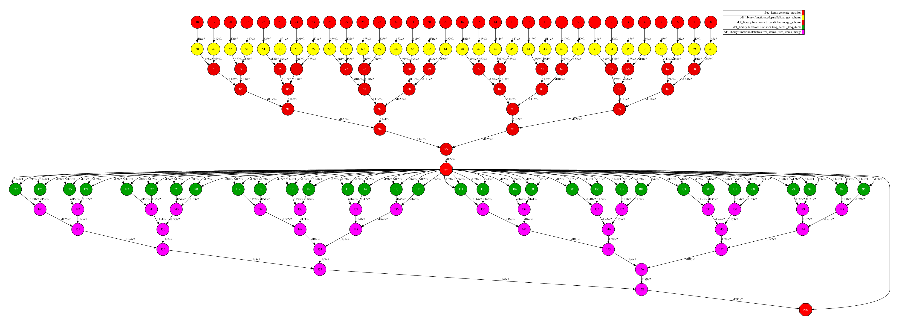
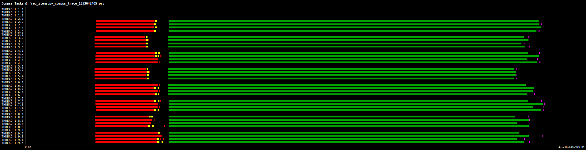
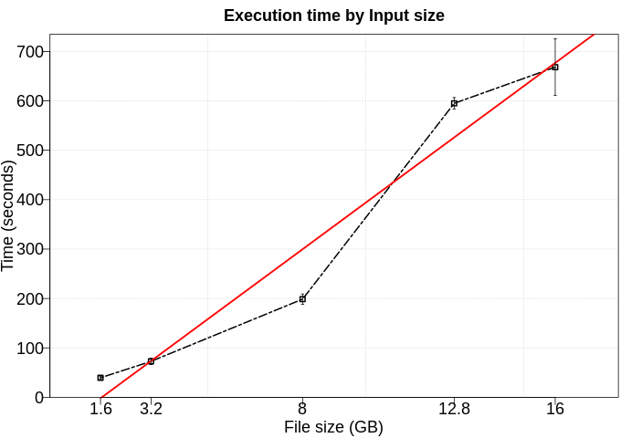

# Frequent Items

Finding frequent items for columns, possibly with false positives. Using the frequent element count algorithm described in "https://doi.org/10.1145/762471.762473, proposed by Karp, Schenker, and Papadimitriou".

# Use Case:

 - Number of workers/partitions: 8 workers / 32 fragments
 - Data length: 10kk rows
 - Parameters: support=0.2
 - Time to run: 29 seconds

## DAG

## Trace

## Execution time by Input size

To the next test, we executed this application using five different numbers of rows (200kk, 400kk, 1kkk, 1.6kkk, 3.2kkk). Furthermore, each configuration was executed five times. In this experiment, we excluded the time to data generation. 

