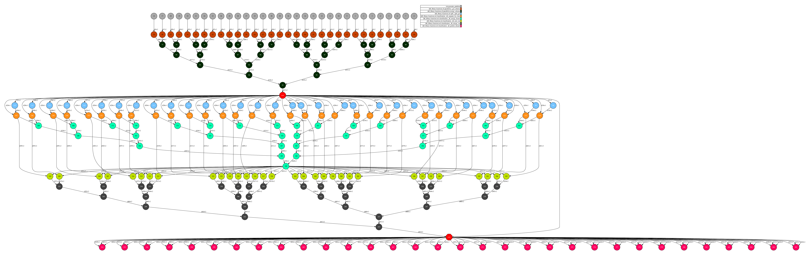
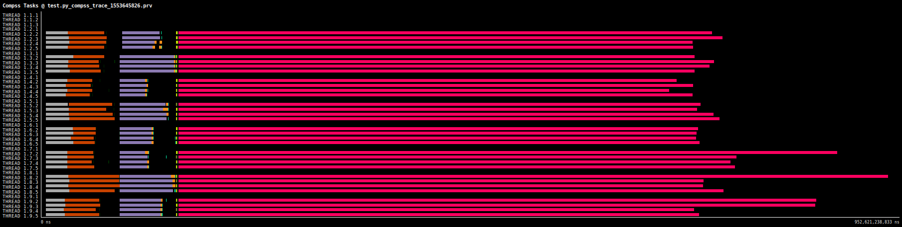

# Gaussian Naive Bayes

The Naive Bayes algorithm is an intuitive method that uses the
probabilities of each attribute belonged to each class to make a prediction.
It is a supervised learning approach that you would  come up with if you
wanted to model a predictive probabilistically modeling problem.

Naive bayes simplifies the calculation of probabilities by assuming that
the probability of each attribute belonging to a given class value is
independent of all other attributes. The probability of a class value given
a value of an attribute is called the conditional probability. By
multiplying the conditional probabilities together for each attribute for
a given class value, we have the probability of a data instance belonging
to that class.

To make a prediction we can calculate probabilities of the instance
belonged to each class and select the class value with the highest
probability.

# Use Case:

 - Number of workers/partitions: 8 workers / 32 fragments
 - Data length: 100kk rows of 2-dimension where, 10% is used as training data and 90% to test the fitted model (generated by split operation)
 - Time to run: 374 seconds

## DAG

## Trace

