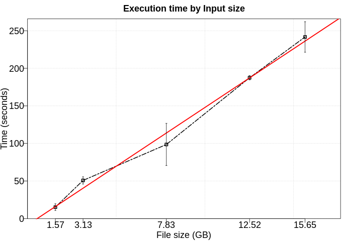
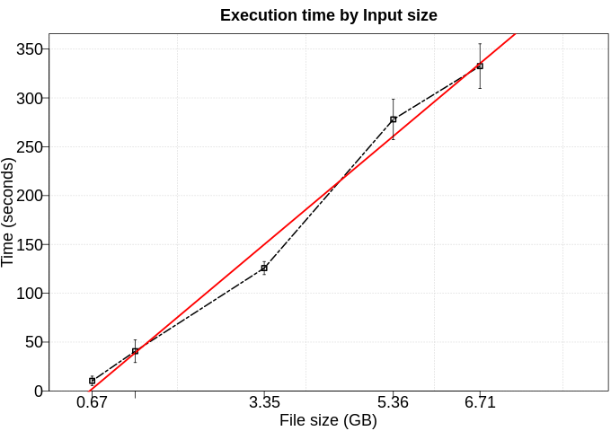

# Gaussian Naive Bayes

The Naive Bayes algorithm that uses the probabilities of each attribute belonged to each class to make a prediction. To make a prediction we can calculate probabilities of the instance belonged to each class and select the class value with the highest probability. In this application, we use a column of integers (binary, but could be used multiple labels) as labels and two columns of float as features. In this example, we split the dataset in two sets, 70% to training the model and 30% to test.

# Use Case:

 - Number of workers: 8

## Performance

We executed this application using five different numbers of rows (100kk, 200kk, 500kk, 800kk, 1000kk). Furthermore, each configuration was executed five times. 

### Fit time

To fit this model, we use 70% of data as training set.

### Transform time

To transform this model, we use 30% of data as test set.

## DAG

## Trace

