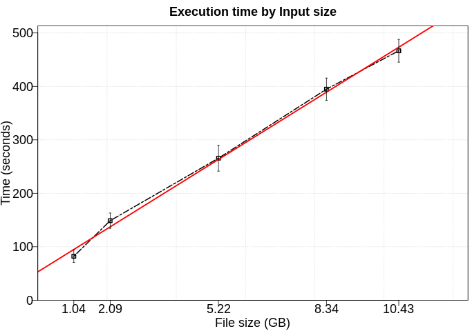

# Kmeans using random init

K-Means is a algorithm used in clustering applications. In this scenario, we create a training set using 70% of the original dataset to create a model. Then, we test this model using 100% of original dataset.

# Use Case:

 - Number of workers: 8

## Performance

We executed this application using five different numbers of rows (100kk, 200kk, 500kk, 800kk, 1000kk). Furthermore, each configuration was executed five times. 

### Fit time

To fit this model, we use 70% of data as training set and limit the number of iterations to 20 (not applicable in a real scenario).

### Transform time

## DAG

## Trace

