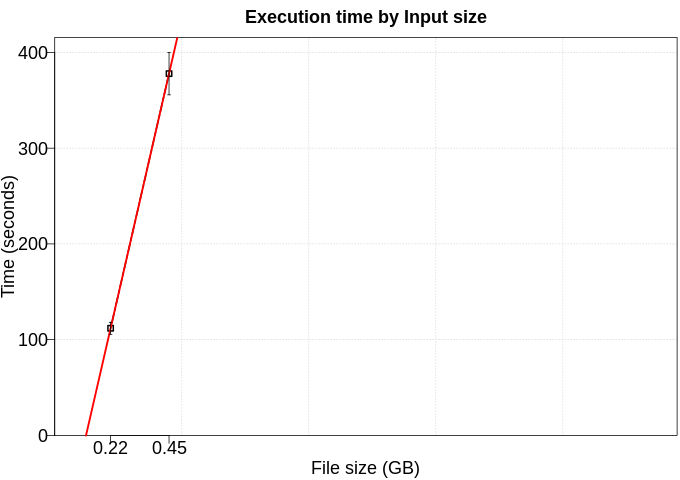
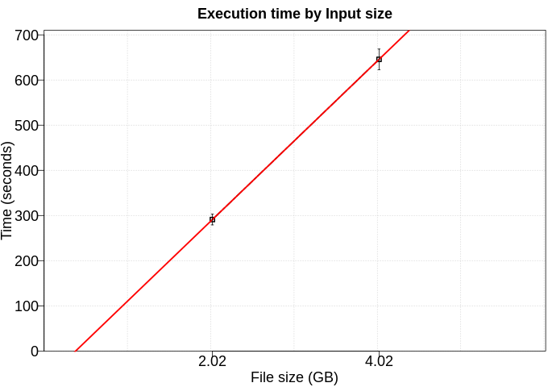
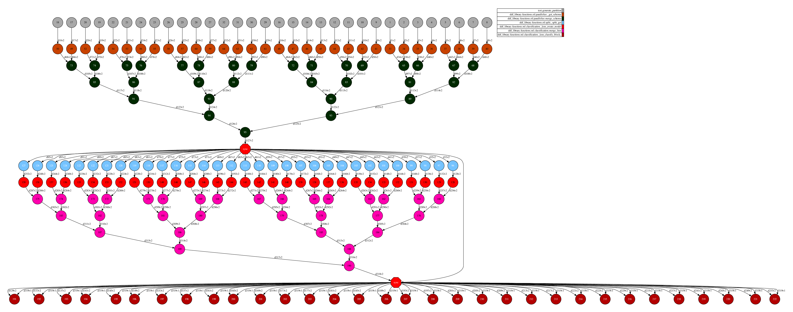
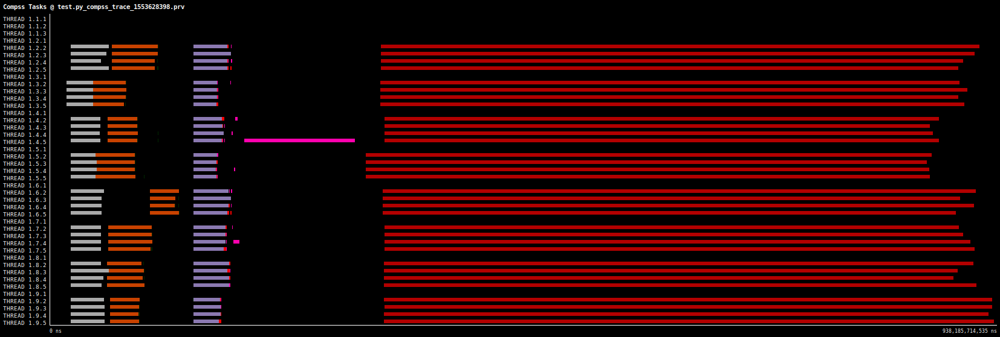

# kNN

K-Nearest Neighbor is a algorithm that can be used to solve classification problems. kNN computes from a simple majority vote of the K nearest neighbors of each point present in the training set. The choice of the parameter K is crucial in this algorithm and depends on the dataset. This algorithm is not scalable because in the training model stage is stored some rows in a Tree, to be compared in the next stage. Because of that, is common perform a small sample with some selected rows that represents well the big set. In this example, we split the dataset in two sets, 10% to training the model and 90% to test.

# Use Case:

 - Number of workers: 8

## Performance

We executed this application using five different numbers of rows (100kk, 200kk, 500kk, 800kk, 1000kk). Furthermore, each configuration was executed five times. 

### Fit time

To fit this model, we use 10% of data as training set and limit the number of iterations to 20 (not applicable in a real scenario).

### Transform time

To test this model, we use 90% of data as testing set.

## DAG

## Trace

