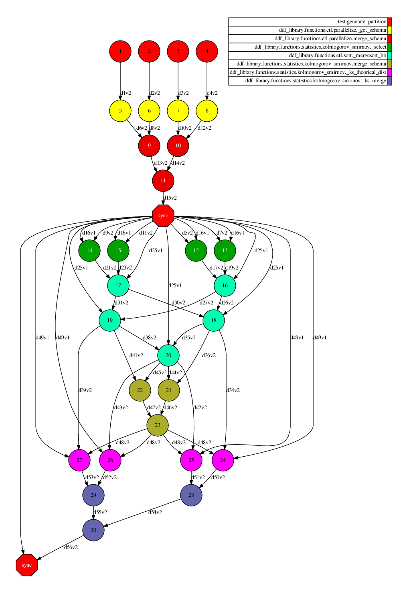
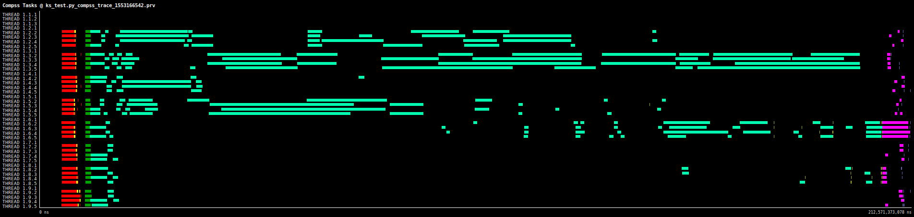

# Kolmogorov-Smirnov test

Perform the Kolmogorov-Smirnov test for goodness of fit. This implementation of Kolmogorov–Smirnov test is a two-sided test for the null hypothesis that the sample is drawn from a continuous distribution.

The algorithm start first by creating a new data with only the column to be tested. Then, this column is sorted by sort algorithm (available in DDF library). If the number of fragments is a power of 2, Batcher odd–even mergesort otherwise uses a commom parallel Odd-Even. 

After that, the minimal distance between the empirical data and the CDFs is calculated in each partition. Finally, these distances is merged to generate the p-value.

# Use Case:

 - Number of workers/partitions: 8 workers / 32 fragments
 - Data length: 100kk rows
 - Parameters: distribution='norm'
 - Time to run: 232 seconds

## DAG

Using 4 fragments (only to preview)

## Trace

