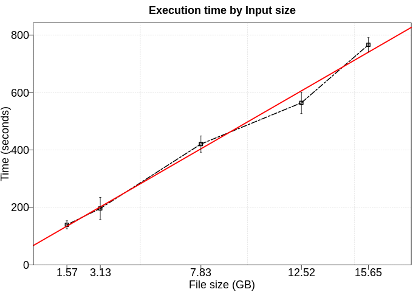
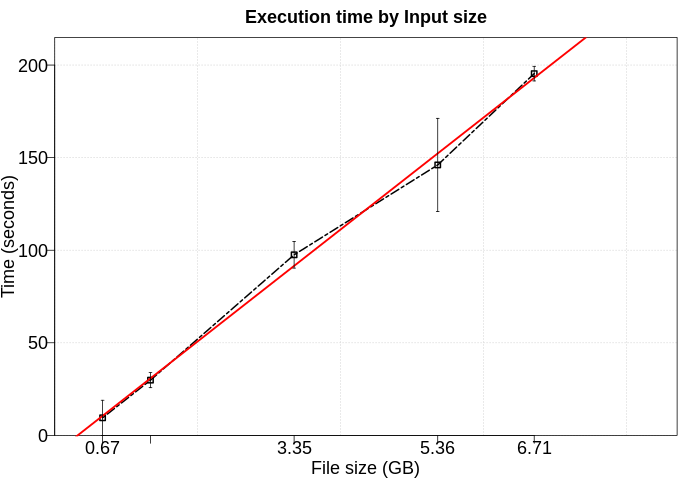
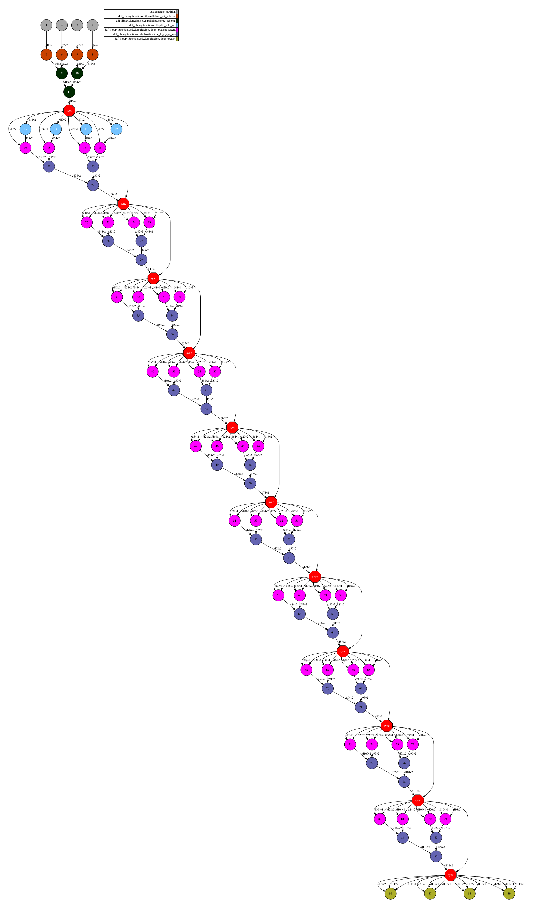
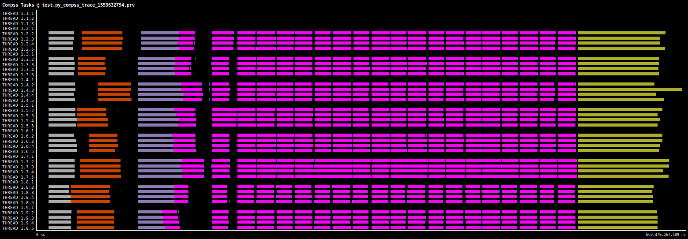

# Logistic Regression

Logistic regression is named for the function used at the core of the method, the logistic function. It is the go-to method for binary classification problems (problems with two class values). This implementation uses a Stochastic Gradient Ascent (a variant of the Stochastic gradient descent). In this application, we use a column of integers (0 and 1) as labels and two columns of float as features.

# Use Case:

 - Number of workers: 8

## Performance

We executed this application using five different numbers of rows (100kk, 200kk, 500kk, 800kk, 1000kk). Furthermore, each configuration was executed five times. 

### Fit time

To fit this model, we used 70% of data as training set and limit the number of iterations to 20 (not applicable in a real scenario).

### Transform time

To transform this model, we used 30% of data as test set.

## DAG

## Trace

