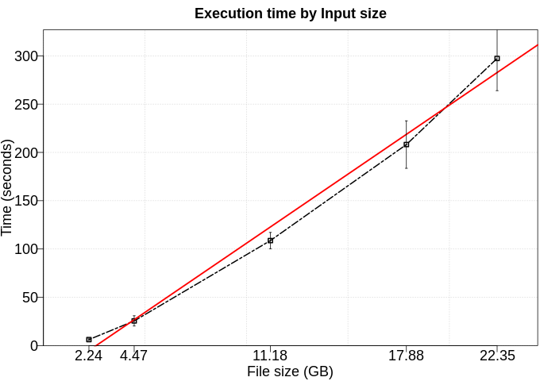
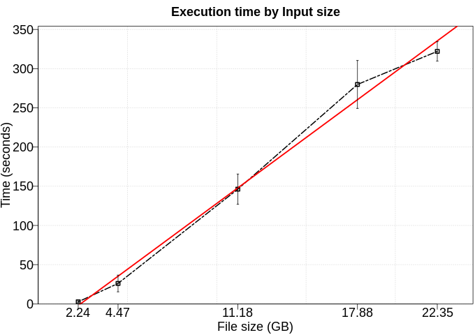

# PCA

PCA is used widely in dimensionality reduction. This process has two stages: Fit and transform.  The first, 'fit', is responsible to generate all informations about the data, while in 'transform' stage is used this information to transform the input columns into new ones. In this application, it row has three columns as features, and we want to use PCA to reduce the dimensionality to two. Both stages used full dataset.

# Use Case:

 - Number of workers: 8

## Performance

We executed this application using five different numbers of rows (100kk, 200kk, 500kk, 800kk, 1000kk). Furthermore, each configuration was executed five times. 

### Fit time

### Transform time

## DAG

## Trace

