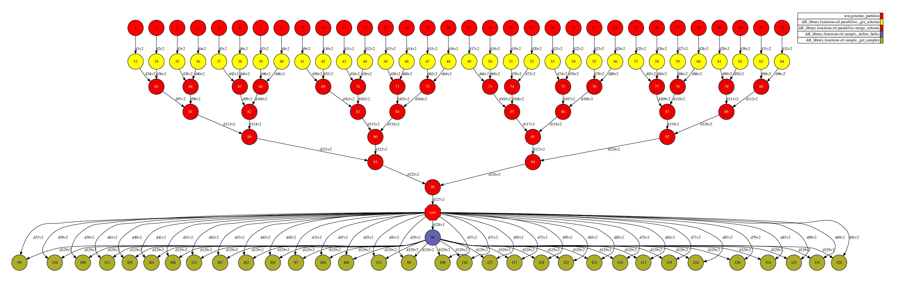
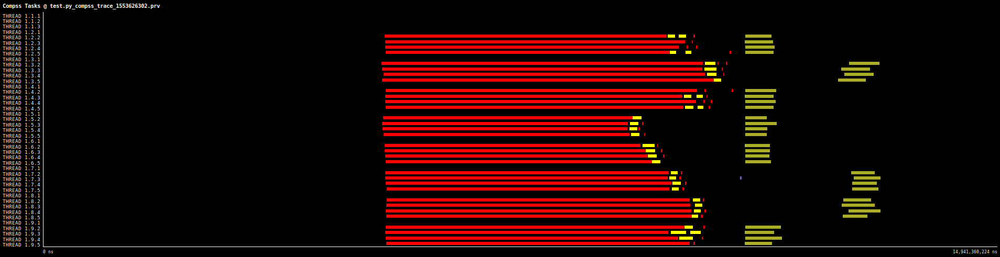

# Sample Test

Returns a sampled subset. If none value is passed by parameter, the sample it will have a random amount of records, otherwise, the user can pass a integer or float to define the size of this sample.

In this case, we are using percentage as 0.2, meaning 20% of rows will be randomly sampled. 

The Sample operation consists of two stages: First stage uses the schema information to fast retrieve the number of rows in each partition. Using this, we establish the amoung of rows *n* to be splitted in each partition. This information is used in the second stage to sample *n* rows from each partition.  

# Use Case:

 - 8 workers (32 cores)
 - 100kk rows 
 - Parameters: fraction=0.2
 - Time to run: 15 seconds

## DAG

## Trace

