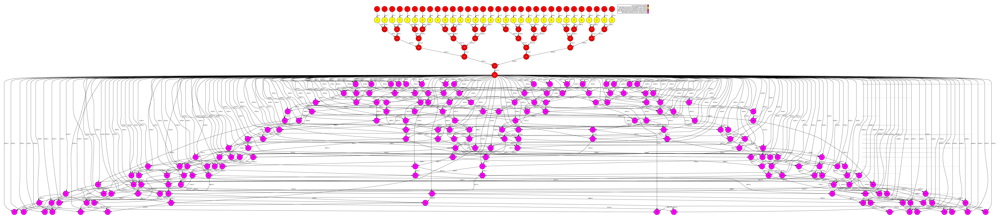
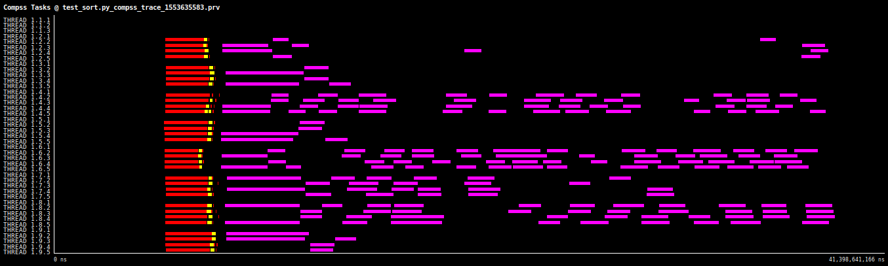

# Sort

DDF Library implements two sort algorithms: Batcher odd–even mergesort and a commom parallel Odd-Even. If the data is completly unsorted, the first algorithm is better, but it can be used only if the number of fragments is a power of 2. Otherwise, use the second algorithm.

# Use Case:

 - Number of workers/partitions: 8 workers / 32 fragments
 - Time to run: 53 seconds

## DAG

## Trace

