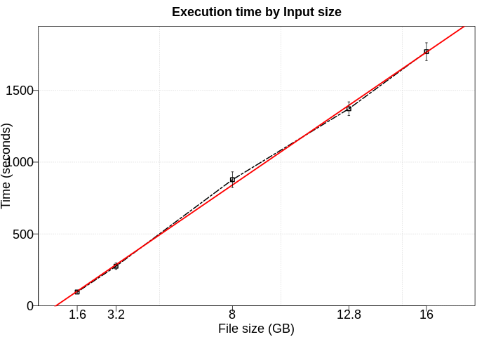

# Sort

DDF Library implements a sort operation in two stages. First, it is re-arranged the data in a way that each key in a partition is between a boundary then, each partition can be sorted separately. 

## Internal algorithms

This algorithm executes internaly the following operations/algorithms: 

1. Range Partition: To split all data into buckets by a range interval definition.

In this sense, any improvement on this operation will benefit also this current algorithm. 

## Execution time by Input size

To the next test, we executed this application using five different numbers of rows (100kk, 200kk, 500k, 800kk, 1000kk). Furthermore, each configuration was executed five times. In this experiment, we excluded the time to data generation. 

## DAG

DAG using 4 cores/fragments

## Sample of Trace

