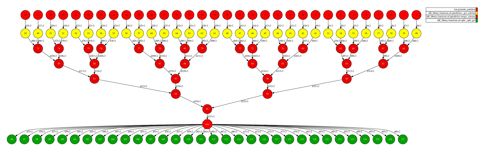
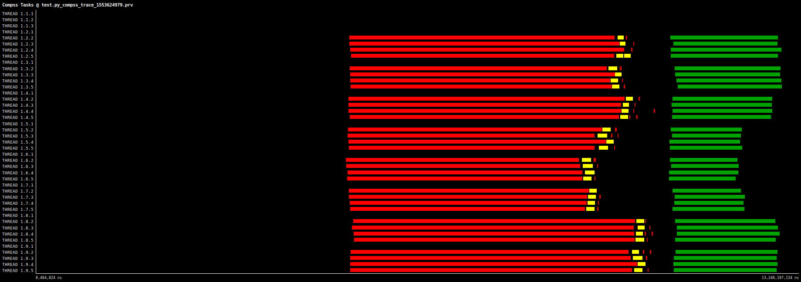

# Split Test

Randomly splits a DDF into two DDF based on a fraction passed by parameter. In this case, we are using percentage as 0.2, meaning 20% of rows will be the first DDF while 80% in the second. 

The Split operation consists of two stages: First stage uses the schema information to fast retrieve the number of rows in each partition. Using this, we establish the amoung of rows *n* to be splitted in each partition. This information is used in the second stage to define how split *n* rows from each partition into a new one.  

# Use Case:

 - 8 workers (32 cores)
 - 100kk rows 
 - Parameters: fraction=0.2
 - Time to run: 14 seconds

## DAG

## Trace

