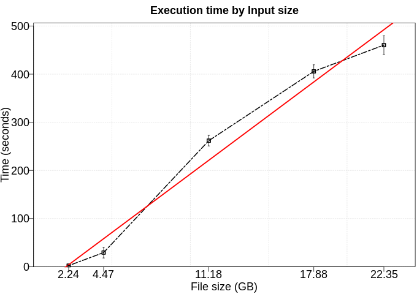

# Split Test

Randomly splits a DDF into two DDF based on a fraction passed by parameter. The Split operation consists of two stages: First stage uses the schema information to fast retrieve the number of rows in each partition. Using this, we establish the amoung of rows *n* to be splitted in each partition. This information is used in the second stage to define how split *n* rows from each partition into a new one.  

In this case, we are using percentage as 0.7, meaning 70% of rows will be the first DDF while 30% in the second. 

# Use Case:

 - Number of workers: 8

## Performance

We executed this application using five different numbers of rows (100kk, 200kk, 500kk, 800kk, 1000kk) where each row contains three columns as features. Furthermore, each configuration was executed five times.

## DAG

## Trace

