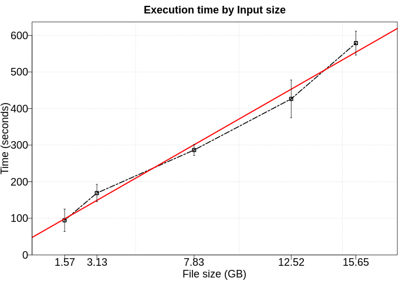
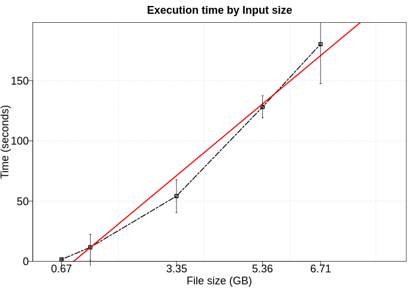
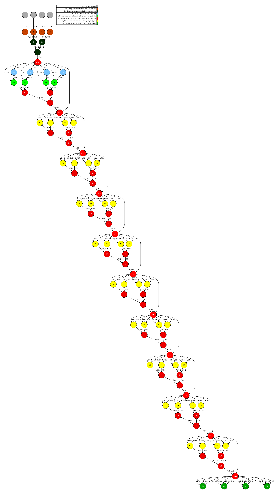
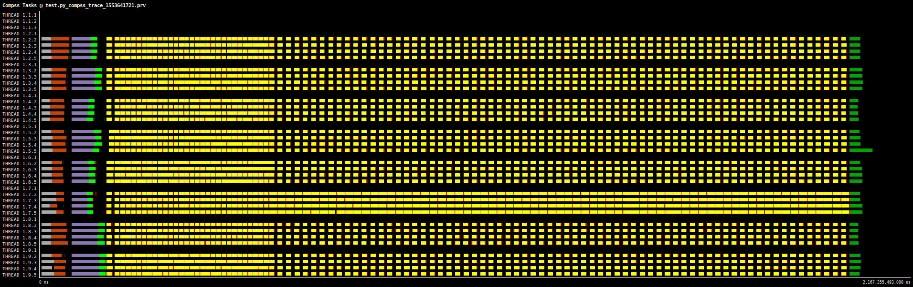

# SVM

Support vector machines (SVM) is a supervised learning model used for binary classification. The algorithm reads a dataset composed by labels (-1 or 1) and features (numeric fields). In this application, we use a column of integers (-1 and 1) as labels and two columns of float as features.

# Use Case:

 - Number of workers: 8

## Performance

We executed this application using five different numbers of rows (100kk, 200kk, 500kk, 800kk, 1000kk). Furthermore, each configuration was executed five times. 

### Fit time

To fit this model, we used 70% of data as training set and limit the number of iterations to 20 (not applicable in a real scenario).

### Transform time

To tranform this model, we used 30% of dataset as test set.

## DAG

## Trace

